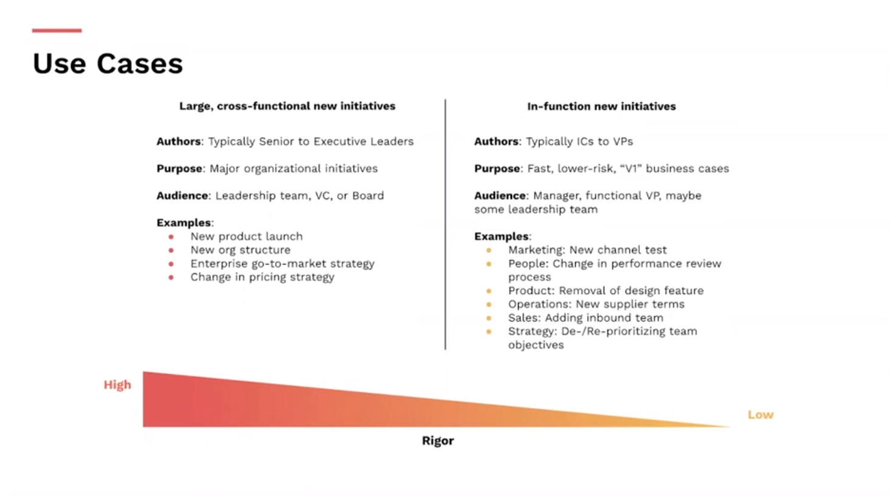
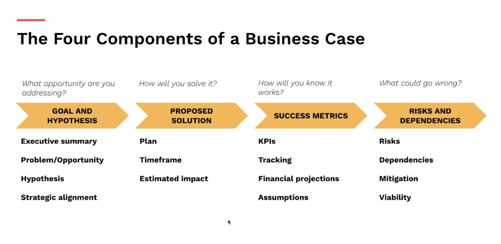
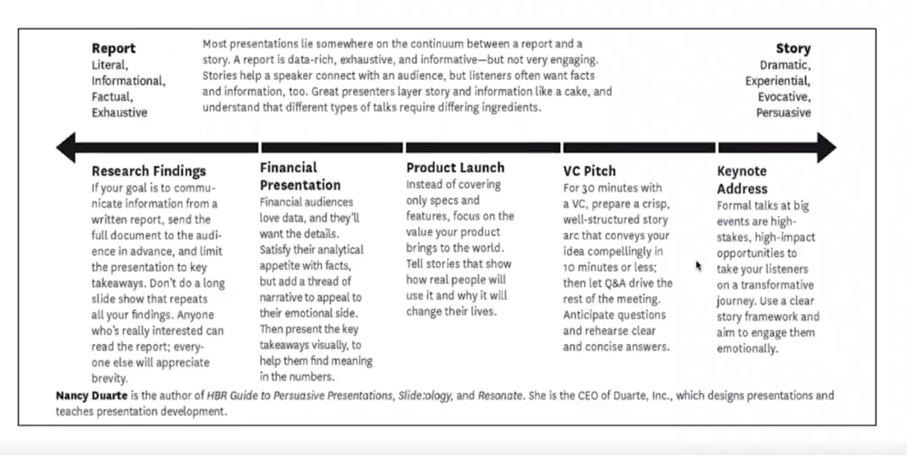
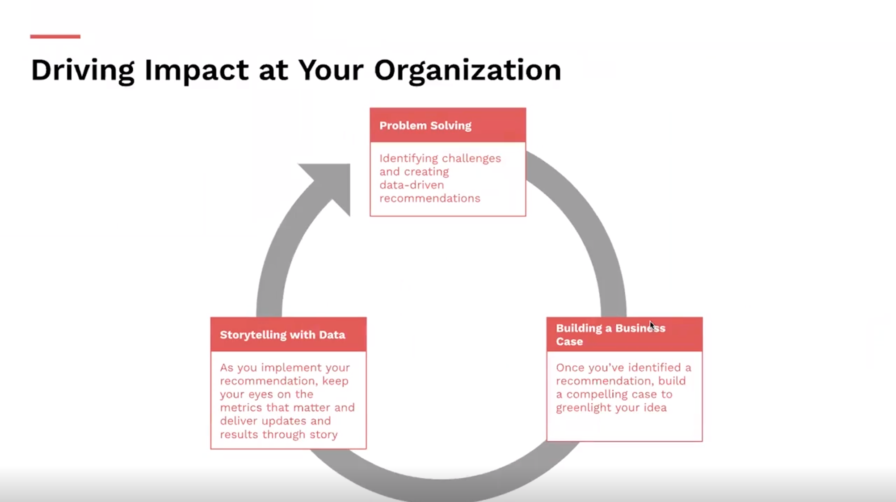

# Building a Business Case

### Get the green light for your ideas

#### with Nicole Alexander

#### Welcome

Welcome to the Building a Business Case course taught by Meta Global Head of Marketing Nicole Alexander.

You’re about to jump into an interactive, engaging experience where you’ll learn an actionable framework. You can expect to spend 2 hours on this course.

#### What you’ll learn

• The components of a compelling business case
• How to build a business case using an easy-to-repeat framework
• How to present that business case to your boss, leadership team, or client

#### How you’ll learn
This course includes nine modules. For each module, watch the video and complete any associated exercises in the project slides ([Microsoft PowerPoint](https://media.sectionschool.com/courses/building-a-business-case/Building_a_Business_Case_Activity_Packet_(1).pptx)). Once you get to the end, submit your project via the survey to earn a LinkedIn badge.

#### Complete the program
Building a Business Case is part of the Business Core certificate program. Complete the required courses to round out your skillset and earn a certificate, in addition to badges for each course. 
Before you get started, make a copy of the project ([Microsoft PowerPoint](https://media.sectionschool.com/courses/building-a-business-case/Building_a_Business_Case_Activity_Packet_(1).pptx)) and keep it open in another window. 
Let’s get started!

### Module 1 - Business Case
Today's framing 
- See an opportunity
- Build a case
- Deliver and persuade

#### What is a business case? 
A business case is a compelling story that presents an oopportunity to add value to an organization and inspire others to act 
#### Who writes business cases? 
Business cases can be written by anyone from ICs to C-Suite excecutives

Business cases can have different audiences and different structures for how they're build and implemented - but most business cases have the same basic components
#### Business cases should
- Align with company strategy
- Be grounded in data and evidence
- Drive positive impact

  
### Module 2 - 4-Step Business Case Framework
  
### Module 3 - Goal & Hypothesis
- An **executive summary**, outlining the key takeaways from your business case
- The **problem or opportunity** you're addressing
- Your **hypothesis** for how to address the problem or opportunity
- **Alignment** with company strategy/priorities
#### Vetting a problem or opportunity
- **Spot** a problem or opportunity
- **Create** business objectives; ensure they align with team/organization's strategy
- **Share** your idea; revise or come up with alternatives if necessary
- **Prove** the problem or opportunity is worth pursuing
- **Size** the impact
### Module 4 - Proposed Solution
- **Plan** including owners, budget, and the buy-in you've already gotten
- Estimated **timeframe** to implement your solution and **resources** you'll need
- The estimated **impact** of this opportunity
#### Plan Components
- **High-level overview:** What are the key components in your plan? What are the top 3-5 milestones?
- **Budget:** How much funding do you need near-term(1-6 months)? What's the total budget required?
- **Timeline:** How long until you you could start? How long until your plan would be fully rolled out?
- **Owners:** Who's going to make this happen?
- **Buy-in:** Who's already signed off on this plan?
### Module 5 - Success Metrics
- **KPIs** you'll use to measure progress
- A plan on how you'll **track** your KPIs
- Estimated **financial impact** of this opportunity
- **Assumptions** you've made in building your financial case
#### Determining Financial Impact
- Most Critical - Ex: Project Costs, Operating Costs
- Basic Metrics - Ex: Return on Investment(ROI), Breakeven
- Advanced Metrics - Ex: Payback Period, Internal Rate of Return(IRR)
#### Impact and Success Metrics
##### Most critical financial terms in your case
- Project Cost(s) - Project expenditure usually occur at the beginning -- they tend to include development, testing and qualification, training and deployment, and travel costs
- Operating Cost(s) - How much money it will take to maintain whatever you're proposing. These include overhead costs, such as personnel, office space, maintenance and licensing fees, and any other ongoing expenses
##### Financial terms that your audience will likely expect to see
|Metric|What is it?|Why does it matter?|Simple formula|
|---|---|---|---|
|Return on investment (ROI)|A percentage that tells you how profitable an initiative will be|If you can't show your business case is profitable, your audience is *much* less likely to five the green light|Net profit / total costs * 100|
|Breakeven|A number that shows how many sales it will take to get your money back on an investment|Your audience will want a concrete number to understand how many sales are requred before you turn a profit|Fixed costs / contribution margin|
##### Slightly more advance financial terms that your audience will likely expect to see
|Metric|What is it?|Why does it matter?|
|---|---|---|
|Payback Period|A certain type of break even - it shows when your audience recoups their investment|Some audiences need to recoup thier money quickly - you'll need to determine how much this matters for yours|
|Internal Rate of Return(IRR)|A number that estimates how profitable your business case will be|IRR quickly tells your audience how "valuable" your case is. The higher the IRR, the more lucrative the opportunity|
### Module 6 - Risks & Dependencies
- Key **risks** the company/team would take if this solution is implemented
- **Dependencies** for your solution's success
- **Mitigation** plan for risks and dependencies you can influence
- Explain why your propasl is the **most de-risked and viable**
#### Risks vs Dependencies
- Risks - a **hypothetical even that could derail your business case**, or its implementation, if it actually occurs. It would be something out of your control. Will cause you to course correct and pivot based on what you originally planned.
- Dependencies - **events or situations that need to happen before the rest of the plan can be implemented** - i.e. the dependency *must* happen, or else the rest of the plan fails. These can be mitigated with enough planning.
Both risks and dependencies can be **internal or external, micro or macro**
### Module 7 - Business Case Example: JCrew
### Module 8 - Presenting your Business Case
Find the perfect mix of Data and Narrative
  
#### Stakeholder Questions to Expect
|Strategy|Operations|Marketing|Product|
|---|---|---|---|
|How does this fit into the company's current roadmap?|If we don't fund this, what is the status quo we're left with?|How do you foresee us introducing the solution?|How does this fit into our existing porfolio?|
|What other possible solutions did you consider|What risks did you consider and how do you recommend mitigation?|What audience insights went into this"(customer survey, brand tracker, concept testing)|Do you foresee this as a compliment to existing solutions or moving into a new category?|
#### Get to an outcome
|What did you hear?|Considerations|Next Steps?|
|---|---|---|
|No, this project isn't a priority|Cases typically get rejected because they're not in synce with strategic goals, projected ROI isn't high enough, or the org simply doesn't have the resources to make it happen|Depending on the reason for rejection, you may be able to build a stronger case later|
|We can't make a decision yet|Stakeholders who agree aobut the business need but don't think you've found the right solution may send you back to the drawing board|Find out what the sticking points are. Does the project take to long? Does it cost too much? Is a strategic element missing? Based on above, adapt|
|We can only approve part of the proposal|2 reaseons why review boards will five the go-ahead on just a portion of the case: process or issues|Move forward on key milestones that can be accomplished with the funding and prove out ROI on phase 1, make adaptations to phase 2 based on learnings|
|Yes, let's move forward|Yes doesnt always mean yes, conflict-averse leaders sometimes approve a project but the never allocate resources for it|Resourcing: Who will elad the project(if not you)? How soon can you have a project plan in place? When can you pull a team together and start on the work? Be ready with answers, you don't want to lose momentum after securing approval|

### Module 9 - Pitfalls & How to Avoid Them
  
