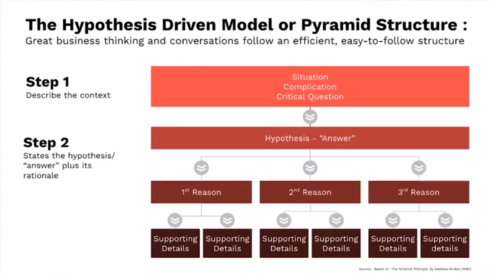

# Problem Solving
### Think like a strategy consultant
### Ridhima Raina

#### Welcome

Welcome to the Problem Solving course taught by Jennie Tung, Partner at Bain & Company and Head of Bain Academy.

You're about to jump into an engaging experience where you'll learn an actionable framework and apply it in a short project. You can expect to spend 1-1.5 hours on this course.

#### What you’ll learn
- Identify and articulate a problem worth solving
- Use a proven framework to formulate a hypothesis and test it with data
- Put together a recommendation that will blow people away

#### How you’ll learn
For each module, watch the video and complete the associated exercise in the project ([Microsoft PowerPoint](https://media.sectionschool.com/courses/problem-solving/Problem_Solving_Project.pptx)). Once you get to the end, submit your project via the survey to earn a LinkedIn badge.

#### Complete the program
Problem-Solving is part of the Business Core certificate program. Complete the required courses to round out your skillset and earn a certificate, in addition to badges for each course.

Before you get started, make a copy of the project document ([Microsoft PowerPoint](https://media.sectionschool.com/courses/problem-solving/Problem_Solving_Project.pptx)) and keep it open in another window. 

Let’s get started!<

#### Module 1 - Problem Solving
Problem Solving is the ability to
- **Frame** the right problem
- **Deconstruct** it into smaller components
- **Prioritize** the most relevant facts and
- **Decide** on a course of action

Range of use cases: strategic and operational and even personal 
Foundational Mental Model: 
##### Goals
- Identify the core components of the hypothesis-driven problem solving approach
- Practice applying this framework in a guided example
- Preview how this framework can help you communicate more effectively in email and verbal updates as well as presentations
- Optional: Add this as a coaching tool to guide your team to work more efficiently
#### Module 2 - Pyramid Struction
Defining the problem 
Situation
Complication
Critical Question
To formulate a 'good' question, ask yourself....
- What **assumptions** am I making in asking the question this way?
- Is this a **macro** or **micro** issue?
- Who will **benefit** from me solving this problem?
#### Module 3 - Defining the Problem
#### Module 4 - Hypothesis, Reasons, and Data
Benefits of Hypothesis Driven Model or Pyramid Structure
- Decompose wthe work: unbundle complexity by identifiyin the key components of your recommendation
- Prioritize the work: Enables decisons around where to focus and where not to focus
Practically, what can helpd you to create an initial hypothesis?
- Reflect on personal experiences
- Brainstorm with team members/colleagues
- Look for industry analogies and how lessons 'learned' can be applied
- Check to see if competitors have made similar decisions in the past
- Don't wait and strive for the perfect answer, get it on paper and treat it as a living document
Developing your reasons: Be 80/20 (Pareto Principal)
- Identify the most impactful issues
- Focus efforts on efficiently finding the best answer
- Answer questions with high-quality data-driven analysis and right level of details
Use Data to prove/disprove your hypothesis 
**Secondary** 
- Internal Data
  - Internal company data: financial, operational, loyalty metrics, strategy, orcanizational structure, etc.
- External research
  - Data, analysis and insights from external sources: market and industry reports, comptetitor data, lit. search, etc.
**Primary**
- Data that doesn't exist yet: consumer, employee, expert interviews and surveys, user research, etc.
#### Module 5 - Next Steps and Recommendations
##### Carrying out next steps 
Once you give your recommendation, you'll want to plan your next steps 
Questions to consider
- How can you further validate your hypothesis?
- What's a low-risk way to ttest your recommendation?
- What metrics will you track while testing to know whether you're right?
- What will be your main risks and exit strategy?
##### Communicating your work: be concise

