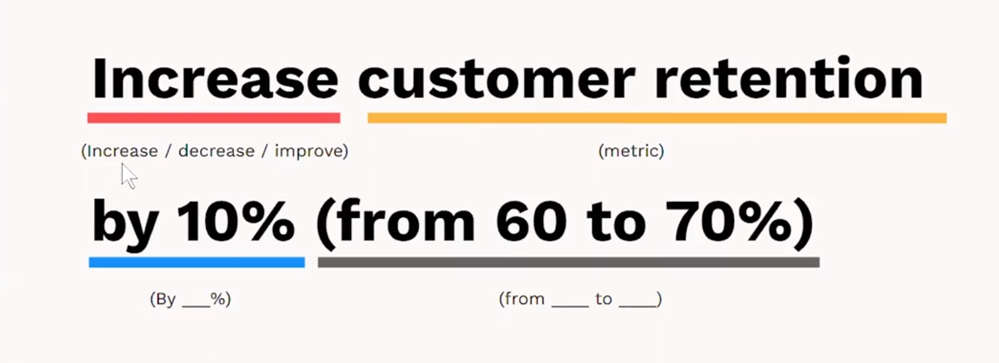

# Strategic Planning

### Translate company strategy into team goals

#### with Sara Lobkovich
#### Welcome

Welcome to the Strategic Planning course taught by Sara Lobkovich, Executive Strategy Leader, OKR Master Coach, and former SVP of planning at Edelmann.

#### What you’ll learn

• How to apply a framework that distills your organization’s or team’s strategic plan
• How to explain the main components of a Connected Strategic™ Stack
• How to create basic OKRs and describe the differences between objectives and key results
• Walk out with a start to your two-page strategic plan

#### How to complete the course

• Watch all lesson videos
• OPTIONAL: Complete activity packet to apply your learnings ([Microsoft](https://media.sectionschool.com/courses/strategic-planning/Strategic_Planning_Activity_Packet.pptx))
• Submit a reflection question to earn a LinkedIn Badge via the survey link at the bottom.

Let’s get started!
### Introduction - What is strategic planning and why is it important?
#### What is "Strategic Planning?
- Strategic planning is the ongoing organizational process of using knowledge to document a business's **intented direction**"
- The strategic planning process defines your business's direction, outlining a **path from your present toward a preferred future**"
#### Why is Tretegic Planning important?
Organizations need alignment -- Percentage of leaders at each level in an organization who can list thier company's top 3 priorities: (Study by Sloan MIT)
- Top Team 51%
- Senior executives 22%
- Middle managers 18%
- Frontline supervisor 13%
#### Use Cases
Strategic planning improves aligning on shcare sence of **purpose**, **prioritation**, and organinzing for **effectiveness**. 
You can use framework to create strategic plans for **organizations and teams**
### Lesson 1 - The Connected Strategic Stack Framework
#### Where Strategic planning goes wrong
- The Confidence Gap - How do we know our activities add up to the achievement of important outcomes?
- The Finanical Focus Gap - When planning focuses on the budget and revene targests, we gain little clarity, alignment, and purpose to inform our work.
- The subjective/objective gap - What objective data are we running the business based on?
#### Enter the Connected Strategic Stack
#### The first page answers high-level questions
|Component|Key Strategic Question|
|---|---|
|Vision|What is our reason for being?|
|Topline Measure|What metrics do our financial success depend on?|
|Objectives|What is most important for us to acheive, and why does it matter?|
#### The second page ensures Strategy and Implementation
OKRs with objectives and key results for measures of progress and success
#### The Connected Strategic Stack(CSS) Closes Gaps and Builds Alignment
- Vision and Topline Measures are **organization-wide** and for closing **financial focus gap**
- Objectives and Key Results are **team-specific** and for closing the **subjective/objective gap** and the **confidence gap**
### Lesson 2 - Having a vision
#### What do we mean by "vision"?
**Definition**
- Purpose and aspiration for the future
- Paints a clear and inspiring picture of what the company wants to achive in the long term

**Why is it important?**

#### Vision Building Blocks
- Gather inputs: 
  - core values, existinge vision, about us company languate
- Reflect on key question
  - What is our reason for being?
- Create:
  - Ideate: when you're successful in your work, **what is the change that you've reated in the world?**
  - In a sentence (or two) write a statement that encapsulates the company's **desired future state** aligned with its core values
### Lesson 3 - Topline measures
#### What do we mean by "topline measures"?
**Definition**
- The most important health measures in our business
- When out topline measures are healthy and growing, so it our business

**Why is it important?**
- Top line measures =! financial results! Topline measures SUPPORT revenue
- Helps the entire org understand most important measures of success
- They enable greater alignment (& less arbitrariness) in team goals
#### Topline Measures Building Blocks
- Gather inputs: 
  - biggest opportunities? Biggest barriers or risks? Industry standard measures?
- Reflect on key question
  - What metrics do our financial success depend on?
- Create:
  - Ideate: What are the most important metrics that most directly contribute to our financial success? (When we get these right, our revenue grows?)
  - Prioritize: What are the 3-5 most important (that many teams in our org contribute to?)
### Lesson 4 - Objectives
#### OKR quick background
- Objectives and key results are a collaborative goal setting practice that was evolved our of management by objective by Peter Drucker
- Popularized by book *Measure what Matters* by John Doerr
#### Why OKRs?
- OKRs clearly communicate whats actually important
- OKRs create space for exprimentation, innovation, and change
- OKRs break the habits of "keeping busy" & "looking good* to help us do better
#### What is an Objective?
**Definition**
- Our objectives are directional statements of shared purpose that describe **what** we're pushing together and **why** it matters

**Why is it important?**
- Each Objective provides **clear, inspring, aspirational** direction for the organization
- Added together, our Objectives should serve as the pillars to achieve success toward our vision + toplines
- Give us **focus** on the significant (usually longer-term) changes the organization is trying to achieve
#### Objective Building Blocks
- Gather inputs: 
  - "Upstream" OKRs or strategy docs, Critical projects, priorities, or themes, Important stakeholders
- Reflect on key question
  - What is most important for us to achieve and why does it matter?
- Create:
  - Ideate: What is the most important for us to achieve?
  - Organize: Cluster your ideas into "Themes"
    - What are the 3-5 most important
  - Purpose: Look at the ideas within the first theme and ask: Why does that matter?(and to whom, if that's helpful)
  - Write a basic Objective candidate
### Lesson 5 - Key results
#### What is a Key Result?
**Definition**
- Key Results are our most important objective measures of progress and/or success

**Why is it important?**
- OKRs give us clarity about what success means: no more mind-reading or constantly moving goal posts
- Objective measurements give us data to make important business dicisions based on
- Our Key Results are presumed to be stretch goals (unless they are clearly labeled COMMIT)
- With stretch Key Results we are safe to try and even fail in the pursuit of learning and progress
#### Building a "Tectbook" Key Result
 
#### Key Result Building Blocks
- Gather inputs: 
  - Topline measures, Objectives, Industry benchmarks, Annual operation plan and/or budget
- Reflect on key question
  - What are our most important measures of progress and success?
- Create: For each Objective, ideate:
  - How will we know we're making progress on this Objective?
  - What outcomes are most important for us to attain this term?
  - When we're going this Objective excellently, what will be different in our business?
  - **Then Focus**: Choose the 3-5 most important and relevante ideas for each objective, and write one measureable goal for each
  - **Refine**: Draft 3-5 most important Key Results as close to "textbook" as possible: "Increase/decrease [metric] by ____ (from ___ to ___ )"
#### Key Takeaways
- **Align** to what already exists when possible
- **Ask key questions** to form insights
- Model **vision and inspiration**
- **Focus and prioritize** to maximize impact and minimize waste
- Set a clear **direction & purpose** so we know where we're amining together
- Courageously **measure progress and success**
